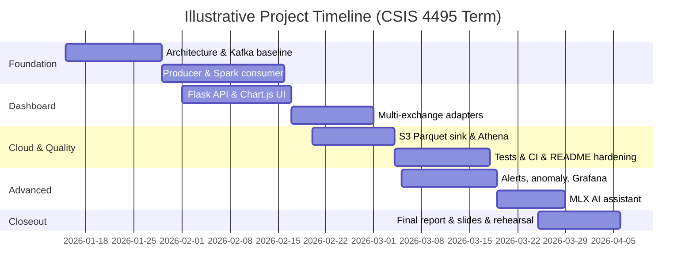

# CSIS 4495 – Applied Research Project  
## Final Report


<div style="page-break-after: always;"></div>

## Title Page

**Title:** Real-Time Multi-Exchange Cryptocurrency Streaming Pipeline: Kafka, PySpark, Operational Dashboards, Cloud Persistence, and AI-Assisted Market Insights  

**Course:** CSIS 4495 – Applied Research Project  
**Section:** S3  

**Student / Team Lead:** Michael Hein  
**Student ID:** 300375535  

**Team members:** Solo project.  
**Team Lead (responsible for joint submissions):** Michael Hein  

**GitHub repository:** https://github.com/MichaelHein915/W26_4495_S3_MichaelH (branch `main`)  

**Submission date:** April 7, 2026  


<div style="page-break-after: always;"></div>

## Table of Contents

1. Introduction  
2. Summary of the Research Project  
3. Changes to the Proposal  
4. Project Completion Timeline and Responsibilities  
5. Implemented Features  
6. Evaluation Techniques  
7. Reflections and Discussion  
8. AI Use Disclosure  
9. Work Date / Hours Logs  
10. Concluding Remarks  
11. References  
12. Appendix A: Installation Guide  
13. Appendix B: User Guide  
14. Appendix C: AI Prompt History (Extended)  

---

## 1. Introduction

### 1.1 Domain and Background

Cryptocurrency markets operate continuously across global venues. Prices and liquidity for the same asset can differ slightly between exchanges because of inventory, fees, latency, and participant mix. For researchers and practitioners, **streaming architectures** that ingest live trades, normalize them, and compute windowed analytics are a standard way to study **microstructure**, **volatility**, and **cross-venue dynamics** at scale.

This project sits in the intersection of **real-time data engineering**, **stream processing**, and **human-facing analytics**. Public exchange WebSocket APIs provide a practical, ethically appropriate data source for a term-length applied research implementation without requiring proprietary market feeds.

### 1.2 Problem Framing

The research addresses the following questions:

1. **How can live trades from multiple exchanges be ingested reliably** into a single stream with a consistent schema suitable for downstream analytics?  
2. **How can near-real-time aggregations** (for example, per-symbol volatility, volume buckets, and price trends) be computed and exposed to users through a responsive dashboard?  
3. **How can the system surface actionable conditions** such as volume spikes, configurable price thresholds, cross-exchange spreads, and multivariate anomalies without overwhelming operators with false positives?  
4. **How can historical data be persisted** for ad hoc SQL analytics and BI, using managed cloud patterns (object storage, query engines, optional warehousing)?  
5. **How can a local large language model (LLM)** assist interpretation of live metrics through natural language, given privacy and latency constraints?

These questions matter because they mirror industry patterns (event buses, stream processors, observability stacks, and operational UIs) while remaining feasible for a student-scale deployment using Docker, Python, and optional AWS services.

### 1.3 Related Work and Knowledge Gaps

Industry and open-source ecosystems offer reference patterns: **Apache Kafka** for durable streaming; **Spark Structured Streaming** for windowed computation; **Flask/FastAPI** for lightweight APIs; **Prometheus/Grafana** for metrics; and **S3 + Athena** for lake-style analytics. Academic and grey literature covers market microstructure and anomaly detection in financial time series.

**Streaming and messaging.** Log-based brokers (Kafka) decouple producers and consumers, enabling replay and horizontal scaling of consumers. For educational projects, a single-broker Docker deployment is sufficient to demonstrate partitioning, consumer groups, and operational concerns such as broker availability.

**Stream processing frameworks.** Spark Structured Streaming provides declarative window operators and checkpoint-based fault tolerance. Alternatives include Apache Flink and ksqlDB; Spark was selected here for Python ecosystem fit and curriculum alignment, accepting that cluster deployment is out of scope.

**Data lakes and query engines.** Object storage (S3) with columnar formats (Parquet) is a common pattern for analytical workloads. Athena provides serverless SQL with pay-per-scan economics suitable for student budgets when queries are bounded. Partition projection reduces operational toil compared with repeatedly repairing partitions.

**Anomaly detection.** Isolation Forest is a classical unsupervised method for continuous feature vectors. It is not a substitute for domain-specific fraud models, but it offers a defensible baseline for flagging multivariate outliers in engineered features derived from streaming metrics.

**LLMs in operational tools.** Large language models are increasingly embedded in analytics products for summarization and natural-language interfaces. Local inference (for example via MLX on Apple Silicon) trades model scale for latency and privacy, which is appropriate for a classroom demo that should avoid mandating paid third-party API keys.

**Gaps this project targets at an applied level:** (i) integrating **multiple public WebSocket feeds** with normalization and exchange attribution; (ii) combining **streaming UI analytics** with **ML-based anomaly scoring** and **rule-based alerting** in one cohesive product; (iii) documenting a **repeatable path** from laptop Docker Compose to optional **AWS persistence and QuickSight**; and (iv) experimenting with **LLM-assisted summarization** grounded in live dashboard context rather than static reports.

### 1.4 Hypotheses, Assumptions, and Expected Benefits

**Hypotheses (practical, engineering-oriented):**

- H1: A **small set of exchange adapters** behind a shared producer can normalize trades into one Kafka topic without excessive operational complexity.  
- H2: **PySpark Structured Streaming** with checkpoints can sustain minute-level window aggregates for demo-scale throughput on consumer hardware.  
- H3: **Isolation Forest** on rolling metric features can flag “unusual” symbols often enough to be useful for demos, while remaining tunable via contamination and history size.  
- H4: A **local MLX-served LLM** can produce readable summaries when fed structured text derived from the same JSON payload the dashboard uses.

**Assumptions:**

- Public WebSocket APIs remain available for educational use during the term; occasional disconnects are normal.  
- Demo evaluation prioritizes **correctness and clarity** over institutional-grade HA and security hardening.  
- AWS components are **optional**; local Docker Compose is the primary grading/demo path.

**Benefits:**

- A portfolio-quality **end-to-end pipeline** demonstrating streaming literacy.  
- A **defensible design narrative** (sources, broker, processing, API, UI, persistence, observability).  
- A foundation for future work (additional exchanges, Flink, Kubernetes, authentication, backtesting).

---

## 2. Summary of the Research Project

The final system, branded in the UI as **CryptoStream**, implements a **real-time cryptocurrency streaming pipeline**. Live trades are collected from **Coinbase**, **Binance**, and **Kraken** (configurable), published to a **Kafka** topic, and consumed by:

- a **PySpark** streaming job (minute-window aggregations to console, with checkpoints);  
- a **Flask** backend that maintains in-memory rolling state for the dashboard;  
- optional **AWS sinks**: **S3 Parquet** with **Athena** external tables (and scripts for **QuickSight**), plus an optional **Redshift** path documented in the repository.

The **web dashboard** provides Chart.js visualizations, KPI cards, exchange filters, volatility and volume views, cross-exchange price comparison, alert integrations (**Slack** and **email**), **arbitrage-style spread highlighting**, and **Isolation Forest** anomaly detection. **Prometheus** and **Grafana** support observability when using Docker Compose.

An **AI assistant** layer (optional) uses an **Apple MLX** OpenAI-compatible server on the host, with endpoints for health, streaming chat, cached periodic **market insights**, and natural-language style queries, using a **context builder** that serializes live dashboard state into LLM-readable text.

A **news and sentiment** path (optional, `NEWS_ENABLED`) ingests articles via pluggable sources (e.g. RSS, CryptoPanic), publishes normalized items to a dedicated Kafka topic, scores headlines with **VADER**, and exposes **`/news`**, **`/api/news`**, and **`/api/sentiment`** plus dashboard widgets (feed, gauge, symbol breakdown, news-spike vs. price chart). The LLM context builder can include top headlines and sentiment summaries when data is present.

The repository includes **automated tests** (`pytest`) for critical modules, CI workflow configuration, and a detailed **README** for installation and operations.

---

## 3. Changes to the Proposal

The following table summarizes how the scope evolved from an initial Coinbase-only, chart-centric plan to the final system.

| Change | Description | Justification |
|--------|-------------|---------------|
| **Dashboard technology** | Early exploration included Streamlit-style prototypes; the deliverable standardized on **Flask + HTML/JS + Chart.js** for finer control over real-time polling, layout, and custom UX. | Streamlit is fast for prototypes but limiting for highly interactive, multi-widget layouts and consistent branding; Flask aligns with production-style API + SPA patterns. |
| **Multi-exchange ingestion** | Expanded from a **single-exchange** Coinbase path to **multi-exchange** producers with a shared schema and `exchange` field. | Directly supports research on **cross-venue price differences** and richer demo datasets. |
| **AWS persistence emphasis** | **S3 + Athena + Parquet** became the primary cloud analytics path; **Redshift Serverless** documented but dependent on account subscription constraints. | Progress work noted Redshift subscription limitations; Athena over Parquet avoids always-on warehouse cost for academic use while still demonstrating **data lake** patterns. |
| **Observability stack** | Added **Prometheus** metrics across producer/dashboard/consumer and **Grafana** dashboards via Compose. | Improves **demonstrability** of health, freshness, and throughput; aligns with industry monitoring practice. |
| **Alerting and ML anomaly detection** | Implemented Slack/email alerts, arbitrage thresholds, volume spike detection, price thresholds, and **Isolation Forest** anomaly scoring. | Moves the project from “charts only” to **operational analytics** with tunable parameters in `.env`. |
| **AI assistant (MLX)** | Added optional **local LLM** integration (`mlx_lm.server`), context builder, SSE streaming chat, and background insight caching. | Supports applied research on **human-in-the-loop** interpretation; keeps inference **local** for latency/privacy compared to defaulting to third-party APIs. |
| **News and sentiment** | Added optional **news producers** (RSS / CryptoPanic adapters), Kafka topic for articles, **VADER** scoring, dashboard **News & Sentiment** section, dedicated **`/news`** page, and APIs **`/api/news`** and **`/api/sentiment`**. | Extends the research narrative beyond price/volume to **textual market signals** and cross-modal comparison (e.g. news volume vs. price), while remaining optional behind `NEWS_ENABLED` and API keys. |

Each change was driven by **iterative prototyping**, **dependency constraints** (AWS account, Docker networking on macOS), and the need for a **coherent final demo** that fits the 12–20 minute defense format.

---

## 4. Project Completion Timeline and Responsibilities

### 4.1 High-Level Phases

1. **Requirements and architecture** – Problem framing, technology selection, baseline repository structure.  
2. **Core streaming path** – Producers, Kafka, schema parsing, Spark consumer.  
3. **Dashboard and analytics** – Flask API, frontend, metrics computation, charts.  
4. **Reliability and quality** – Tests, CI, bug fixes, duplicate removal, documentation.  
5. **Cloud persistence** – S3 sink, Athena DDL, example queries, QuickSight helper scripts.  
6. **Advanced features** – Alerts, anomaly detection, multi-exchange polish, observability.  
7. **AI integration** – MLX client, context builder, routes, Docker host networking.  
8. **Final packaging** – README, user/install guides, presentation, report, rehearsal.

### 4.2 Gantt-Style Schedule (Illustrative)

The following diagram summarizes major phases and dependencies over the term.



### 4.3 Team Responsibilities

This was a solo project: all responsibilities in §4.1 were carried out by the author.

---

## 5. Implemented Features

### 5.1 Multi-Exchange Ingestion and Kafka Publishing

**Design:** Exchange-specific WebSocket clients inherit from a shared abstraction (`base_exchange.py`). Trades are normalized to a common representation including **symbol**, **price**, **size**, **timestamp**, and **exchange** metadata.

**Implementation notes:** `multi_exchange_producer.py` orchestrates parallel connections; environment variable `EXCHANGES` restricts venues. Kafka topic naming is centralized via configuration (`config.py`, `env.example`).

**Parsing and schema consistency.** Shared parsing utilities (`src/utils/parse_trade.py`) reduce duplication between producers and consumers. This matters because each venue’s wire format differs (field names, scaling, pairing conventions such as USDT vs USD). Normalization is the contract that allows the dashboard to treat “BTC” activity comparably across venues **when pairs map cleanly**, while still exposing the raw venue label for transparency.

**Reliability considerations.** WebSockets disconnect under network churn; producers should log reconnect behavior and avoid silent stalls. For the term project, operational expectations are **best-effort continuity** suitable for demonstration rather than 99.9% SLA.

**Operational validation.** Producer logs show multiple venues when `EXCHANGES` is configured accordingly; the dashboard `/health` endpoint reflects Kafka connectivity and data freshness.

### 5.2 Stream Processing with PySpark

**Design:** `spark_stream.py` consumes the raw topic and emits **windowed aggregations** (for example, one-minute average price and trade counts per symbol), writing to console for verification and using **checkpoint directories** for recovery semantics.

**Operational note:** First run may download connector artifacts; checkpoint reset is documented in the README for development recovery.

### 5.3 Flask Dashboard and Analytics Core

**Design:** The dashboard API aggregates buffered events into metrics used by the frontend: KPIs, recent trades, volatility bars, volume-over-time series, and optional cross-exchange comparison when multi-exchange data is present.

**Implementation separation:** `analytics.py` holds pure functions where feasible, keeping `api_server.py` as orchestration. The UI uses `index.html`, `styles.css`, and `app.js` with Chart.js.

**API shape and polling model.** The frontend periodically fetches a consolidated JSON payload and updates charts. This is simpler than WebSocket push for a term project and remains “real-time enough” at 1–5 second refresh intervals for spot crypto trades. A production system might add server-sent events or a WebSocket channel; the current approach optimizes for debuggability and predictable load.

**UX features (late term):** Market insight summary cards, watchlist with `localStorage`, gainers/losers filters, collapsible sections, skeleton loading, improved empty states—documented in Progress Report 5.

**Accessibility and polish.** Header controls include ARIA labeling and keyboard shortcut affordances (as noted in progress logs). While not a full WCAG audit, these choices show awareness that dashboards are used by humans under time pressure during operations.

### 5.4 Alerting, Arbitrage Highlights, and Anomaly Detection

**Alerting:** `alerts.py` dispatches Slack webhooks and SMTP email with cooldown logic to reduce noise.

**Arbitrage-style signals:** Configurable spread threshold highlights discrepancies between exchanges for the same logical asset mapping.

**Anomaly detection:** `anomaly.py` implements **Isolation Forest** on features including trade count, volatility, log-scaled volume, and price change percentage, with rolling history and contamination tuning via environment variables.

### 5.5 Optional AWS Data Lake and BI

**S3 sink:** Buffers Kafka messages and flushes **Parquet** datasets partitioned in a Hive-style layout for scalable scans.

**Athena:** `setup_athena.py` creates databases/tables; `run_query.py` demonstrates SQL analytics.

**QuickSight:** Helper script provisions data sources/datasets toward SPICE-backed analyses—suitable for capstone-level BI narrative.

**Redshift path:** Documented for optional deployment; schema and sink code illustrate warehouse loading patterns.

**Engineering tradeoffs.** Micro-batching trades balances API call overhead against latency. Tunables such as flush interval and maximum batch size appear in environment configuration so short demos can limit cloud cost. Columnar Parquet improves scan efficiency for analytics queries compared with raw JSON in object storage.

**Failure modes addressed in docs.** Region mismatches between buckets and Athena workgroups are a common configuration issue; `AWS_REGION` must align with the bucket. Athena query results can be demonstrated even when Redshift is not enabled on the account.

### 5.6 Observability (Prometheus and Grafana)

Metrics include published trade counts, Kafka send errors, dashboard request latency histograms, event buffer sizes, data freshness, and consumer running state. Grafana includes a provisioned **Crypto Pipeline** dashboard for pipeline status during runs.

### 5.7 AI Assistant (Optional MLX Path)

**Components:**

- `llm_service.py` – client for OpenAI-compatible MLX server endpoints, timeouts, health checks, streaming.  
- `context_builder.py` – converts live dashboard payloads into structured textual context and prompt templates.  
- `ai_routes.py` – Flask blueprint for `/api/ai/*` routes including SSE streaming.  
- Background thread periodically refreshes cached “latest insight” when AI is enabled.

**Docker note:** `extra_hosts` mapping enables the containerized dashboard to reach a host-run MLX server on macOS Docker Desktop (`host.docker.internal`).

### 5.8 News Ingestion, Sentiment, and News UI

**Design:** Optional news sources under `Implementation/news/` implement a shared `BaseNewsSource` contract. Adapters include **RSS** (no API key) and **CryptoPanic** (API key in `.env`). Normalized articles are published to a configurable Kafka topic; the Flask dashboard consumes that topic in a background thread when `NEWS_ENABLED` is true.

**Sentiment:** Headlines are scored with **VADER** (lexicon-based), producing compound scores and positive/negative/neutral labels used in aggregates and per-currency breakdowns.

**Surfaces:** The main dashboard embeds sentiment summaries, a headline feed, and a **news spike vs. price** dual-axis chart. A dedicated **`/news`** page (`news.html`, `news-page.js`) provides a fuller sentiment gauge, time series, symbol table, and searchable feed. REST endpoints **`/api/news`** and **`/api/sentiment`** support inspection and testing.

With `NEWS_ENABLED` and source credentials configured, the feed and spike-vs-price chart illustrate how article volume aligns with price activity for a selected symbol.

### 5.9 Automated Testing and CI

`pytest` covers configuration parsing, producers/parsing, API behavior, sinks, news/sentiment analytics, and other modules under `tests/`. GitHub Actions workflows build images and run tests, supporting reproducibility.

---

## 6. Evaluation Techniques

Evaluation was **multi-method**, appropriate for an engineering research artifact:

### 6.1 Automated Unit and Integration Tests

**Method:** Run `pytest` locally and in CI.  

**Outcome:** Validates parsing edge cases, configuration loading, API contracts, and sink logic without manual repetition.

### 6.2 End-to-End Functional Smoke Tests

**Method:**  
- `docker compose up --build` with producer + dashboard.  
- Verify UI receives updating trades, charts move, filters work, and `/health` reports acceptable freshness.  
- Optional: enable the news pipeline (`NEWS_ENABLED` and source config); confirm `/news`, `/api/news`, and `/api/sentiment` return coherent data while Kafka ingests articles.  
- Optional: run S3 sink + Athena queries to confirm partitions appear and SQL returns expected rows.

**Outcome:** Confirms **wiring correctness** across containers and host networking.

### 6.3 Observability Review

**Method:** Inspect Prometheus metrics and Grafana panels under load (multiple symbols, multiple exchanges).

**Outcome:** Validates **non-functional** aspects: error rates, latency, and freshness, which supports discussion of design trade-offs.

### 6.4 Anomaly Detection Sanity Check

**Method:** Tune `ANOMALY_CONTAMINATION` and history parameters; observe whether flagged symbols correlate with visible spikes or outliers in charts.

**Outcome:** Demonstrates **qualitative** utility; not claimed as calibrated financial fraud detection.

### 6.5 AI Output Review

**Method:** Compare LLM summaries against raw metrics table for a fixed window; test failure modes when MLX server is offline.

**Outcome:** Informs prompt design and timeout handling; supports honest discussion of **hallucination risk** and **grounding** limitations.

### 6.6 Design Decisions Informed by Evaluation

- Prefer **Athena path** when Redshift subscription is unavailable.  
- Use **cooldowns** for alerts after observing alert storms during testing.  
- Use **log-scaled volume feature** after observing skew in raw volumes.  
- Add **host.docker.internal** after container could not reach localhost MLX.

### 6.7 Limitations (Explicit)

This project is not a production trading system. Latency is not minimized to microseconds; order book depth is not modeled; backtesting and PnL are out of scope. Anomaly labels are not validated against ground truth. LLM outputs may be incorrect or stale relative to the latest tick and must be treated as **narrative assistance**, not financial advice.

---

## 7. Reflections and Discussion

**Challenges:** Exchange WebSocket quirks, timezone normalization, checkpoint recovery during development, AWS region alignment (bucket vs CLI defaults), Docker resource limits for Spark, and bridging **containerized** services with a **host** LLM server.

**Lessons learned:** Centralized configuration pays dividends; separating **pure analytics** from HTTP serving simplifies testing; observability accelerates debugging; documentation is part of the deliverable, not an afterthought.

**Most satisfying elements:** Seeing multi-exchange prices side by side in the UI; running SQL in Athena over data the pipeline itself produced; watching Grafana corroborate “the system is alive.”

**Future work:** Authentication and role-based access; Kubernetes deployment; additional exchanges; Flink or ksqlDB comparisons; formal user study with structured SUS surveys; stronger evaluation of anomaly precision/recall on recorded datasets.

---

## 8. AI Use Disclosure

### 8.1 Table of AI Tools and Specific Use

| AI Tool Name | Version, Account Type | Specific feature for which the AI tool was used | Value addition (human work beyond AI output) |
|--------------|----------------------|-------------------------------------------------|----------------------------------------------|
| Cursor (Claude) | Cursor IDE + Claude | UI redesign scaffolding, component structure, CSS organization | Manual tuning of visuals, accessibility checks, cross-browser testing, integration with existing JS |
| Cursor (Claude) | Cursor IDE + Claude | MLX client design, SSE streaming patterns | Validation against `mlx_lm.server`; timeouts, error handling, and prompt boundaries |
| Cursor (Claude) | Cursor IDE + Claude | Context builder text templates | Field selection for relevance; verification against live `/api/metrics` payloads |
| Cursor (Claude) | Cursor IDE + Claude | S3/Athena design discussions | AWS provisioning, region/bucket alignment, and query verification on real partitions |
| Cursor (Claude) | Cursor IDE + Claude | Code review and duplicate file cleanup | Ran `pytest` and Compose smoke tests; confirmed fixes; updated README and env docs |
| Cursor (Claude) | Cursor IDE + Claude | Report outlining, section structure, and wording edits | Technical accuracy, integration with the implemented system, figures, and final proofreading by the author |

### 8.2 Appendix Reference

Representative prompts appear in **Appendix C**; further examples appear in progress report submissions where required by the course.

---

## 9. Work Date / Hours Logs

**Student name:** Michael Hein  

| Date | Hours | Description of work done |
|------|-------|--------------------------|
| Feb 27, 2026 | 2.0 | Researched Athena + S3 Parquet patterns; designed Hive partitioning layout for trades and candles. |
| Feb 27, 2026 | 1.5 | Implemented `s3_sink.py` (Kafka consume, buffer, Parquet flush to S3). |
| Feb 27, 2026 | 1.0 | Extended `config.py` and `env.example` for S3/Athena/sink tuning. |
| Feb 28, 2026 | 1.5 | Implemented `setup_athena.py` (database + external tables + partition projection). |
| Feb 28, 2026 | 1.5 | Implemented `run_query.py` with example analytics queries. |
| Mar 1, 2026 | 1.0 | Removed duplicate legacy files; fixed Spark import; fixed S3 prefix mismatch; fixed Athena hourly query grouping. |
| Mar 1, 2026 | 1.0 | Updated README for AWS sinks, variables, troubleshooting. |
| Mar 1, 2026 | 1.0 | End-to-end test: Coinbase → Kafka → S3 → Athena. |
| Mar 19, 2026 | 1.5 | Dashboard rebrand (CryptoStream), Inter font, favicon, header layout, ARIA/keyboard affordances. |
| Mar 19, 2026 | 1.5 | Market Insights cards (direction, avg change, active symbol, volume, volatility, BTC dominance). |
| Mar 19, 2026 | 1.0 | Watchlist/favorites with `localStorage`; live cards + modal integration. |
| Mar 19, 2026 | 1.0 | Gainers/Losers filters; skeleton loading; empty-state UX. |
| Mar 19, 2026 | 1.5 | Major CSS overhaul (theme, collapsible sections, responsive layout). |
| Mar 21, 2026 | 2.0 | Added `llm_service.py` (MLX OpenAI-compatible client, streaming, health). |
| Mar 21, 2026 | 1.5 | Added `context_builder.py` for LLM market context. |
| Mar 21, 2026 | 2.0 | AI routes: health, chat SSE, insights, structured query endpoint; insight daemon thread. |
| Mar 21, 2026 | 1.0 | Docker Compose AI env vars + `host.docker.internal` connectivity for MLX. |
| Mar 21, 2026 | 0.5 | `scripts/start_mlx_server.sh` helper for Apple Silicon. |
| Mar 21, 2026 | 1.0 | Frontend AI chat panel + insights display wiring. |
| Apr 7, 2026 | 2.0 | Final report: integrated news/sentiment and AI sections, references, appendices, proofreading, PDF preparation. |

---

## 10. Concluding Remarks

This applied research project delivers a **credible end-to-end streaming system** from live exchange feeds to user-facing analytics, with optional **cloud persistence** and **observability**, and an experimental **LLM-assisted** interpretation layer. The implementation balances **ambition** with **demo reliability**, and the written artifacts (README, guides, report) are intended to make the work **auditable and reproducible**.

The strongest takeaway is that **real-time systems are integration projects**: adapters, schemas, backpressure, checkpoints, monitoring, and UX must co-evolve. The work provides a solid base for professional portfolios and for more rigorous future research on evaluation methodology and production hardening.

### 10.1 Deliverables and Presentation

The written submission follows the course structure: introduction and literature context, project summary, proposal changes, timeline, implementation, evaluation, reflection, AI use disclosure with prompts, work logs, conclusions, references, and appendices for installation and user guidance.

The repository **`README.md`** on `main` documents local Compose startup and optional AWS sinks; Appendices A and B summarize the same paths for readers who prefer a self-contained document.

The oral defense uses roughly **five minutes** of slides on motivation, architecture (Kafka, Spark, Flask, Docker, optional AWS, Prometheus/Grafana), and challenges (WebSockets, checkpoints, cloud regions, container-to-host MLX). The remainder is a live walkthrough: multi-exchange producer output, updating dashboard, an alert or anomaly example, and optionally Athena or Grafana.

---

## 11. References

1. Apache Kafka Documentation. *https://kafka.apache.org/documentation/*  
2. Apache Spark Structured Streaming Guide. *https://spark.apache.org/docs/latest/structured-streaming-programming-guide.html*  
3. Coinbase Exchange WebSocket API. *https://docs.cloud.coinbase.com/exchange/docs/websocket-overview*  
4. Binance WebSocket Streams. *https://binance-docs.github.io/apidocs/spot/en/#websocket-market-streams*  
5. Kraken WebSocket API v2. *https://docs.kraken.com/api/docs/websocket-v2/*  
6. Flask Documentation. *https://flask.palletsprojects.com/*  
7. Prometheus Documentation. *https://prometheus.io/docs/*  
8. Amazon Athena User Guide. *https://docs.aws.amazon.com/athena/*  
9. Amazon S3 User Guide. *https://docs.aws.amazon.com/s3/*  
10. Liu, F. T., Ting, K. M., & Zhou, Z.-H. (2008). “Isolation Forest.” *IEEE ICDM* (primary citation for Isolation Forest).  
11. Pedregosa et al. (2011). “Scikit-learn: Machine Learning in Python.” *JMLR* (library reference).  
12. Apple MLX. *https://github.com/ml-explore/mlx* (framework reference for the version used in the demo environment)  
13. Hutto, C. J., & Gilbert, E. (2014). “VADER: A Parsimonious Rule-based Model for Sentiment Analysis of Social Media Text.” *ICWSM* (VADER lexicon; as used via NLTK in the news pipeline).  

---

<div style="page-break-after: always;"></div>

## Appendix A: Installation Guide

**Purpose:** Reproduce the **local demo** from the repository.

### A.1 Prerequisites

- Docker Desktop  
- Python 3.11+  
- Java 11 or 17 (for PySpark)  
- Git  
- *(Optional)* AWS CLI v2 for sinks  

### A.2 Clone and Python environment

```bash
git clone https://github.com/MichaelHein915/W26_4495_S3_MichaelH.git
cd W26_4495_S3_MichaelH
python3 -m venv venv
source venv/bin/activate
pip install -r requirements.txt
cp config/env.example .env
```

### A.3 Run full stack (recommended)

```bash
docker compose up --build
```

Then open:

- Dashboard: `http://localhost:5000`  
- Grafana: `http://localhost:3000` (default credentials per README)  
- Prometheus: `http://localhost:9093`  

**What “healthy” looks like.** Within about a minute of startup, Kafka should pass Docker health checks; producer logs should show periodic price lines; the dashboard’s freshness metric should remain small (seconds), not grow without bound.

### A.3b Manual path (alternative startup)

If a full Compose stack is not used, run Kafka and ZooKeeper via Compose, then run Python modules from the host with `venv` activated:

1. `python Implementation/producer/multi_exchange_producer.py`  
2. *(Optional)* `python Implementation/consumer/spark_stream.py`  
3. `python Implementation/dashboard/api_server.py`  

This path is useful when debugging Spark JAR downloads or host networking separately.

### A.4 Optional AWS profile

```bash
docker compose --profile aws up -d --build
```

Configure `.env` with S3/Athena/Redshift variables as documented in the repository `README.md`.

**Athena verification.** (1) Bucket exists in the chosen region. (2) `S3_STAGING_PREFIX` receives objects while the sink runs. (3) `setup_athena.py` completes without invalid location errors. (4) `run_query.py` prints non-empty results for recent partitions.

### A.5 Verification

- Producer logs show trades.  
- Dashboard charts update.  
- `GET /health` returns OK status for Kafka connectivity and freshness.  

Full installation detail is maintained in the repository **`README.md`**.

---

<div style="page-break-after: always;"></div>

## Appendix B: User Guide

**Audience:** End user / client evaluator running the dashboard.

### B.1 Opening the application

1. Ensure the pipeline is running (`docker compose up` or manual steps per Appendix A).  
2. Open a browser to `http://localhost:5000`.  
3. **Figure B-1.** Dashboard overview *(screenshot in submitted PDF).*

### B.2 Understanding the main dashboard

1. **KPI cards** – high-level counts: trades, symbols, volume, exchanges, freshness.  
2. **Recent trades** – latest executions with venue attribution (multi-exchange).  
3. **Metrics table** – sortable/filterable per-symbol stats; sparklines where implemented.  
4. **Charts** – volatility, volume over time, price trends, cross-exchange comparison.  
5. **Exchange filter** – restrict views to Coinbase, Binance, or Kraken.  
6. **Time window and refresh** – adjust polling window (for example 1–10 minutes) and refresh interval (1–5 seconds).  

**Figure B-2.** Metrics table and charts *(screenshot in submitted PDF).*

### B.3 Watchlist and insights

1. Star symbols to add them to the **watchlist** (persisted locally in the browser).  
2. Open **Market Insights** cards for computed summaries.  
3. When the AI assistant is enabled, open the **AI chat** panel to ask questions about the current market context.  

**Figure B-3.** Watchlist, insights, and AI panel *(screenshot in submitted PDF).*

### B.4 Alerts (operator perspective)

Alerts may fire via Slack or email when:

- Volume spike ratio exceeds configuration.  
- Cross-exchange spread exceeds threshold.  
- Price crosses user-defined thresholds.  
- Anomaly detector flags a symbol.  

### B.5 API documentation

Visit `/api/docs` for REST endpoint overview when that route is enabled in the build.

### B.6 Troubleshooting (user-visible)

- If charts freeze, verify the producer is still publishing and refresh the page.  
- If the site does not load, confirm port `5000` is free or set `DASHBOARD_PORT`.  

---

<div style="page-break-after: always;"></div>

## Appendix C: AI Prompt History (Extended)

The following prompts were used with **Cursor (Claude)** during development. Additional prompts appear in progress report attachments where submitted for the course.

**P1 – S3 sink design**  
> I need to write a Kafka consumer that reads from crypto.trades.raw, buffers messages, and periodically flushes them as Parquet files to S3 with Hive-style partitioning (year/month/day/hour). It should also compute 1-minute OHLCV candles and write those as a separate Parquet dataset. Can you help me structure this?

**P2 – Athena partition projection**  
> How do I create Athena external tables over my S3 Parquet data? I want partition projection so I don't have to run MSCK REPAIR TABLE every time new data arrives.

**P3 – Athena query examples**  
> Write me example Athena queries for my crypto pipeline: recent trades, trade count by symbol, latest 1-minute candles, and an hourly volume summary.

**P4 – Code review and cleanup**  
> Review the codebase and identify duplicates, bugs, and inconsistencies.

**P5 – Dashboard redesign**  
> Redesign the dashboard with Inter font, rebrand to CryptoStream, add market insight summary cards, and a watchlist with localStorage persistence.

**P6 – Collapsible sections**  
> Make chart sections collapsible with smooth animation and section icons.

**P7 – MLX integration**  
> Add an AI assistant using Apple MLX with OpenAI-compatible API, streaming chat, and market insights from live dashboard data.

**P8 – Docker to host LLM**  
> Dashboard runs in Docker; MLX server runs on the host macOS — how to connect to localhost:8080?

**P9 – Background insights**  
> Add a background thread that periodically generates cached market insight summaries.

---

## Checklist (Course Page 1)

- [ ] Final implementation checked in on `main`, demo ready  
- [ ] Presentation slides in repo under `DocumentsAndReports` (or per section naming)  
- [ ] Defense rehearsed (≤5 min slides, remainder demo; solo or each member if team)  
- [ ] README installation instructions current  
- [ ] User guide with screenshots in repo + Appendix B complete  
- [ ] Blackboard submission by team lead  
- [ ] PDF report on `main`  
- [ ] Mandatory in-person check-ins scheduled/completed  

---
